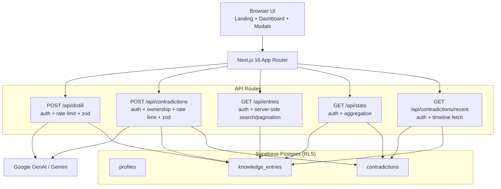

# Noesis

**A personal AI knowledge curation platform with contradiction intelligence.**

Noesis helps you turn scattered content into a structured knowledge system. It distills high-signal ideas from tweets, blogs, and videos, makes them searchable, and surfaces contradictions so your understanding improves over time.

---

## Portfolio Pitch

Noesis is not a bookmarking app. It is a curation and reasoning system.

It solves three hard problems in one product:

- turning noisy long-form content into usable structured knowledge
- keeping retrieval fast as the dataset grows
- detecting conflicting claims across saved content

---

## Quick Start

```bash
git clone https://github.com/garg-tejas/noesis.git
cd noesis
pnpm install

cp .env.local.example .env.local
# fill in Supabase + Gemini values

# run SQL files in scripts/ using Supabase SQL editor (in order)

pnpm dev
```

Open `http://localhost:3000`.

---

## Problem

Saving content is easy. Building reliable understanding is hard.

Read-later workflows usually fail because:

- high-value signal is buried in low-value content
- knowledge is stored but not retrieved when needed
- contradictory claims accumulate silently

---

## What Noesis Does

### 1) AI Distillation

- accepts Twitter/X text, blog text, and YouTube URLs
- extracts `core_ideas`, `context`, `actionables`, and `tags`
- assigns a `quality_score` from 0 to 100

### 2) Retrieval and Curation

- server-side search and filtering across all user entries
- pagination for scalability
- filters by source, tags, and quality threshold

### 3) Contradiction Intelligence

- analyzes only semantically related entry groups (tag-based grouping)
- returns pairwise contradictions with explanations
- persists contradictions with canonical pair normalization and dedupe

### 4) Knowledge Operations UI

- quality and source analytics panel
- top tags and quality-band summaries
- recent contradiction timeline ("Knowledge Tensions")

### 5) Personal Layer

- favorites
- per-entry notes
- contradiction notes appended to both impacted entries

---

## System Architecture



---

## API Surface

| Endpoint | Method | Purpose |
|---|---|---|
| `/api/distill` | `POST` | Distill user-provided content into structured knowledge |
| `/api/entries` | `GET` | Server-side search, filters, tags, and pagination |
| `/api/contradictions` | `POST` | Analyze selected entries for contradictions and persist results |
| `/api/contradictions/recent` | `GET` | Fetch latest stored contradictions with lightweight entry context |
| `/api/stats` | `GET` | Fetch dashboard-level analytics (quality, sources, favorites, tags) |

All API endpoints enforce authentication and return structured error codes.

---

## Request Lifecycle

### Flow A: Ingestion

1. User submits raw text or YouTube URL.
2. `POST /api/distill` validates payload with Zod.
3. Route enforces auth + rate limit.
4. `services/geminiService.ts` calls Gemini with timeout/retry wrappers.
5. Distilled payload is returned and saved into `knowledge_entries`.
6. Dashboard refreshes entries, stats, and recent contradictions.

### Flow B: Retrieval

1. User updates search/filter controls.
2. Dashboard debounces search input and aborts stale requests.
3. `GET /api/entries` validates query params and performs user-scoped search.
4. UI renders paginated cards plus updated analytics context.

### Flow C: Contradiction Scan

1. User triggers "Run Tension Scan".
2. Client sends server-authoritative `entryIds`.
3. `POST /api/contradictions` validates IDs and verifies ownership.
4. Gemini checks grouped related entries for contradictions.
5. Valid contradictions are canonicalized, deduplicated, and persisted.
6. Contradiction notes are appended to both affected entries.
7. Dashboard timeline and stats refresh.

---

## Why This Is Hard (And What Noesis Solves)

### 1) LLM output quality is variable

Challenge: model output can be slow, malformed, or inconsistent.

Noesis solution:

- strict schema validation at request boundaries
- timeout + retry with exponential backoff
- upstream timeout/error mapping to clear API error codes

### 2) Contradiction detection is noisy by default

Challenge: naive all-pairs comparison produces false positives and high cost.

Noesis solution:

- only compares semantically related groups
- validates contradiction pairs against accessible entries
- canonical pair ordering + deduped persistence

### 3) Retrieval degrades with scale

Challenge: client-side filtering creates stale UX and poor scalability.

Noesis solution:

- server-side filtering and pagination
- debounced search
- stale request cancellation and out-of-order response protection

### 4) Security boundaries are easy to break

Challenge: trusting client-provided IDs can leak data.

Noesis solution:

- explicit auth checks in every route
- server-side ownership verification for all `entryIds`
- row-level security on Supabase tables

### 5) AI endpoints can be abused

Challenge: unrestricted LLM requests increase cost and instability.

Noesis solution:

- per-user + IP fixed-window rate limiting
- `429 RATE_LIMITED` responses with `Retry-After`

---

## Reliability and Failure Strategy

- standardized API error model (`UNAUTHORIZED`, `FORBIDDEN`, `VALIDATION_FAILED`, `RATE_LIMITED`, `UPSTREAM_TIMEOUT`, `UPSTREAM_ERROR`, `INTERNAL_ERROR`)
- best-effort contradiction note writes (one failure does not abort all)
- migration-backed uniqueness for contradiction persistence
- defensive parsing and validation for all route inputs
- safe client error mapping for user-facing messages

---

## Security Model

- Supabase Auth for identity
- RLS enabled on all core tables
- API routes enforce user authentication server-side
- API keys remain server-side only
- contradiction analysis only runs on entries owned by the requesting user

---

## Data Model (High Level)

### `profiles`

- `id` (references auth user)
- `email`
- `created_at`

### `knowledge_entries`

- `id`, `user_id`
- `source_type`, `original_url`, `author`
- `raw_text`
- `distilled` (JSON: ideas, context, tags, actionables, quality)
- `is_favorite`, `user_notes`
- `created_at`

### `contradictions`

- `id`, `user_id`
- `item1_id`, `item2_id` (canonical pair ordering)
- `description`
- `created_at`
- uniqueness index on normalized `(user_id, pair, description)`

---

## 3-Minute Interview Demo Script

### 0:00 - 0:20 | Frame the problem

"Most tools help you save links. Noesis helps you curate understanding and catch contradictions."

### 0:20 - 1:00 | Distill a new source

1. Open dashboard.
2. Click `Curate New`.
3. Paste a short text sample (or YouTube URL).
4. Show generated ideas, tags, actionables, and quality score.

### 1:00 - 1:40 | Show retrieval quality

1. Search by keyword.
2. Filter by source and quality threshold.
3. Show that results are paginated and update quickly during typing.

### 1:40 - 2:20 | Run contradiction scan

1. Click `Run Tension Scan`.
2. Show contradiction output in modal.
3. Close modal and show `Recent Contradictions` timeline + updated contradiction count.

### 2:20 - 3:00 | Highlight engineering depth

Walk through:

- route-level auth and validation
- rate limiting on AI endpoints
- timeout/retry handling for Gemini
- canonicalized contradiction persistence and dedupe

---

## Conversation Starters (To Lead Interviews)

- "Do you want me to walk through the contradiction dedupe migration and why it matters for idempotency?"
- "Should I explain how I prevent stale client fetches from overwriting new results?"
- "Want to see how API error contracts are standardized across routes and UI?"
- "I can show where rate limiting and upstream fallbacks protect reliability and cost."

---

## Tech Stack

- **Framework:** Next.js 16 (App Router)
- **Language:** TypeScript
- **Database/Auth:** Supabase Postgres + RLS + Supabase Auth
- **AI:** Google GenAI (Gemini, model configurable via env)
- **Styling:** Tailwind CSS + Radix UI
- **Deployment:** Vercel

---

## Limitations

- no PDF or paper ingestion yet
- contradiction outputs still require human judgment
- quality score depends on model behavior and prompt quality
- optimized for personal-scale usage, not team collaboration

---

## Roadmap

- PDF and academic paper ingestion
- knowledge graph view
- spaced repetition for high-value insights
- export to Obsidian / Notion
- browser extension capture flow
